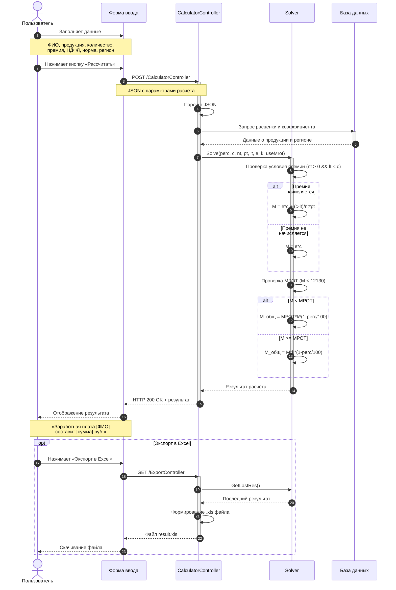

Sequence diagram

```mermaid
sequenceDiagram
    autonumber
    actor User as Пользователь
    participant Form as Форма ввода
    participant Controller as CalculatorController
    participant Solver as Solver
    participant DB as База данных

    User->>Form: Заполняет данные
    Note over User,Form: ФИО, продукция, количество,<br/>премия, НДФЛ, норма, регион

    User->>Form: Нажимает кнопку «Рассчитать»
    Form->>Controller: POST /CalculatorController
    activate Controller
    Note over Form,Controller: JSON с параметрами расчёта

    Controller->>Controller: Парсинг JSON
    Controller->>DB: Запрос расценки и коэффициента
    activate DB
    DB-->>Controller: Данные о продукции и регионе
    deactivate DB

    Controller->>Solver: Solve(perc, c, nt, pt, lt, e, k, useMrot)
    activate Solver

    Solver->>Solver: Проверка условия премии (nt > 0 && lt < c)

    alt Премия начисляется
        Solver->>Solver: M = e*c + (c-lt)/nt*pt
    else Премия не начисляется
        Solver->>Solver: M = e*c
    end

    Solver->>Solver: Проверка МРОТ (M < 12130)
    alt M < МРОТ
        Solver->>Solver: M_общ = МРОТ*k*(1-perc/100)
    else M >= МРОТ
        Solver->>Solver: M_общ = M*k*(1-perc/100)
    end

    Solver-->>Controller: Результат расчёта
    deactivate Solver

    Controller-->>Form: HTTP 200 OK + результат
    deactivate Controller

    Form-->>User: Отображение результата
    Note over Form,User: «Заработная плата [ФИО]<br/>составит [сумма] руб.»

    opt Экспорт в Excel
        User->>Form: Нажимает «Экспорт в Excel»
        Form->>Controller: GET /ExportController
        activate Controller
        Controller->>Solver: GetLastRes()
        Solver-->>Controller: Последний результат
        Controller->>Controller: Формирование .xls файла
        Controller-->>Form: Файл result.xls
        deactivate Controller
        Form-->>User: Скачивание файла
    end
```

