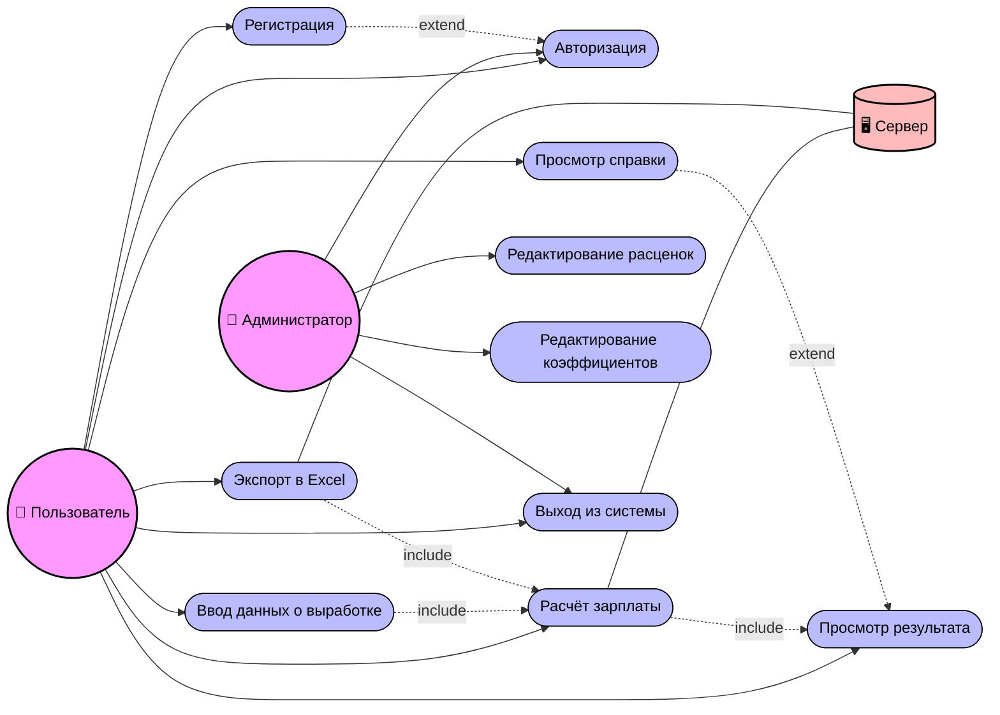

```mermaid
flowchart LR
    %% Актёры
    User((👤 Пользователь))
    Admin((👤 Администратор))
    Server[(🖥️ Сервер)]

    %% Варианты использования
    UC1([Авторизация])
    UC2([Регистрация])
    UC3([Ввод данных о выработке])
    UC4([Расчёт зарплаты])
    UC5([Просмотр результата])
    UC6([Экспорт в Excel])
    UC7([Просмотр справки])
    UC8([Редактирование расценок])
    UC9([Редактирование коэффициентов])
    UC10([Выход из системы])

    %% Связи актёров с вариантами
    User --> UC1
    User --> UC2
    User --> UC3
    User --> UC4
    User --> UC5
    User --> UC6
    User --> UC7
    User --> UC10

    Admin --> UC1
    Admin --> UC8
    Admin --> UC9
    Admin --> UC10

    %% Include-связи (обязательные)
    UC3 -.->|include| UC4
    UC4 -.->|include| UC5
    UC6 -.->|include| UC4

    %% Extend-связи (опциональные)
    UC2 -.->|extend| UC1
    UC7 -.->|extend| UC5

    %% Связь с сервером
    UC4 --- Server
    UC6 --- Server

    %% Стили
    classDef actor fill:#f9f,stroke:#000,stroke-width:2px, color:black
    classDef usecase fill:#bbf,stroke:#000,stroke-width:1px, color:black
    classDef server fill:#fbb,stroke:#000,stroke-width:2px, color:black

    class User,Admin actor
    class UC1,UC2,UC3,UC4,UC5,UC6,UC7,UC8,UC9,UC10 usecase
    class Server server
```